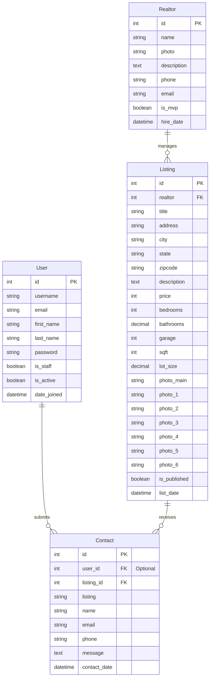

# BTRE Project Database Schemas

This document defines the database schemas for the BTRE (Boston Real Estate) application, covering custom applications (`realtors`, `listings`, and `contacts`) and the integration with Django's built-in authentication system.

## Entity-Relationship (ER) Diagram

---

## Table Schemas

### 1. `realtors` Table

Represents the realtors who list and manage properties.

| Field Name    | Data Type    | Constraints / Attributes    | Description                                       |
| :------------ | :----------- | :-------------------------- | :------------------------------------------------ |
| `id`          | Integer      | Primary Key, Auto-Increment | Unique identifier for the realtor                 |
| `name`        | Varchar(200) | Not Null                    | Full name of the realtor                          |
| `photo`       | Varchar(100) | Not Null                    | Path/URL to the realtor's photo image             |
| `description` | Text         | Nullable                    | Biography/description of the realtor              |
| `phone`       | Varchar(20)  | Not Null                    | Contact phone number                              |
| `email`       | Varchar(50)  | Not Null                    | Contact email address                             |
| `is_mvp`      | Boolean      | Default: `False`            | Flag indicating if realtor is Seller of the Month |
| `hire_date`   | DateTime     | Default: `Now()`            | Date and time when hired                          |

### 2. `listings` Table

Represents the real estate listings.

| Field Name            | Data Type    | Constraints / Attributes                          | Description                                  |
| :-------------------- | :----------- | :------------------------------------------------ | :------------------------------------------- |
| `id`                  | Integer      | Primary Key, Auto-Increment                       | Unique identifier for the listing            |
| `realtor`             | Integer      | Foreign Key (`realtors.id`), ON DELETE DO NOTHING | Realtor managing the property                |
| `title`               | Varchar(200) | Not Null                                          | Headline/title of the listing                |
| `address`             | Varchar(200) | Not Null                                          | Street address                               |
| `city`                | Varchar(100) | Not Null                                          | City location                                |
| `state`               | Varchar(100) | Not Null                                          | State location                               |
| `zipcode`             | Varchar(20)  | Not Null                                          | Zip/Postal code                              |
| `description`         | Text         | Nullable                                          | Detailed description of the property         |
| `price`               | Integer      | Not Null                                          | Asking price                                 |
| `bedrooms`            | Integer      | Not Null                                          | Number of bedrooms                           |
| `bathrooms`           | Decimal(2,1) | Not Null                                          | Number of bathrooms (e.g. 2.5)               |
| `garage`              | Integer      | Default: 0                                        | Garage capacity (car spaces)                 |
| `sqft`                | Integer      | Not Null                                          | Total square footage                         |
| `lot_size`            | Decimal(5,1) | Not Null                                          | Lot size in acres                            |
| `photo_main`          | Varchar(100) | Not Null                                          | Path/URL to primary display photo            |
| `photo_1` - `photo_6` | Varchar(100) | Nullable                                          | Optional secondary/interior photos           |
| `is_published`        | Boolean      | Default: `True`                                   | Flag indicating if listing is active/visible |
| `list_date`           | DateTime     | Default: `Now()`                                  | Date when property was listed                |

### 3. `contacts` Table

Represents client inquiries made on listings.

| Field Name     | Data Type    | Constraints / Attributes               | Description                                   |
| :------------- | :----------- | :------------------------------------- | :-------------------------------------------- |
| `id`           | Integer      | Primary Key, Auto-Increment            | Unique identifier for the inquiry             |
| `user_id`      | Integer      | Foreign Key (`auth_user.id`), Nullable | ID of the registered user (if logged in)      |
| `listing_id`   | Integer      | Foreign Key (`listings.id`), Not Null  | ID of the property                            |
| `listing`      | Varchar(200) | Not Null                               | Title/name of the property at time of inquiry |
| `name`         | Varchar(200) | Not Null                               | Name of the enquirer                          |
| `email`        | Varchar(100) | Not Null                               | Email address of the enquirer                 |
| `phone`        | Varchar(100) | Nullable                               | Phone number of the enquirer                  |
| `message`      | Text         | Nullable                               | Inquiry message body                          |
| `contact_date` | DateTime     | Default: `Now()`                       | Date/time when inquiry was submitted          |
